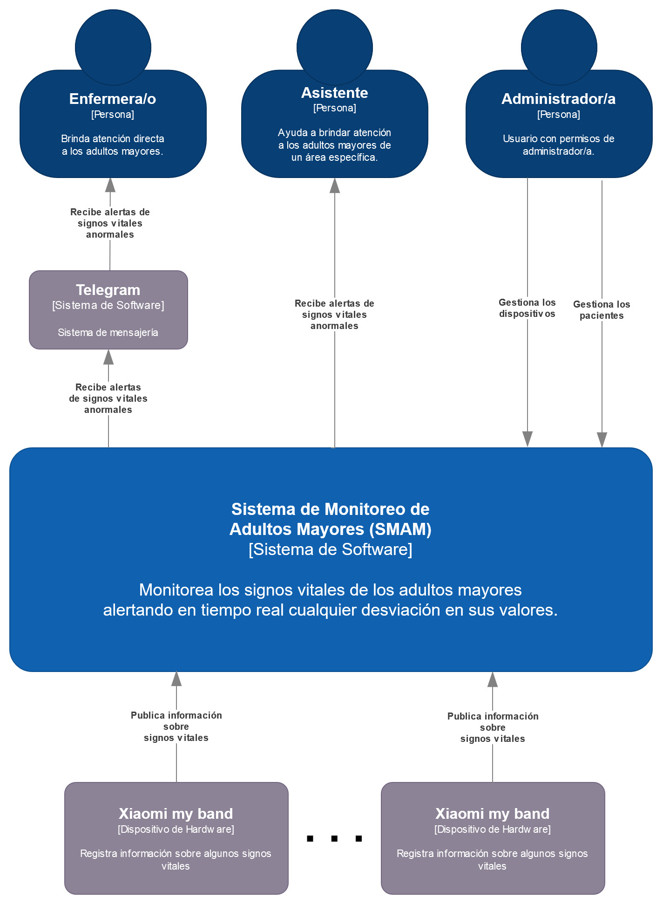

# Arquitectura Publica-Suscribe

## Sistema de Monitoreo de Adultos Mayores (SMAM)

Existe un un lugar llamado Seten en el que viven un grupo de adultos mayores, parte del personal que trabaja en este lugar, entre otras tareas, se dedica a atender las necesidades de los adultos mayores y a monitorear su estado de salud.

La comunidad llamada Girls that Code in Python, que es una comunidad altruista en la región, decidió, a manera de donación, desarrollarles un sistema de cómputo para realizar las actividades de monitoreo del estado de salud de los adultos mayores de forma (semi-)automática. Para ello, la comunidad utilizó un conjunto de dispositivos “wearables” que portan cada uno de los adultos mayores. Mediante el envío de información sobre ritmo cardiaco, presión arterial y temperatura, estos dispositivos “wearables” permiten monitorear en tiempo real a cada uno de los adultos mayores y de esta forma ser más eficientes en la prevención de incidencias.

En la siguiente figura se muestra el diseño de la propuesta de solución del departamento de desarrollo para el SMAM.



## Estructura del proyecto

Este repositorio contiene los siguientes directorios y archivos:

```bash
    ├── docs                                # carpeta de documentación
    │  ├── context-view.png                 # vista del contexto del sistema
    │  ├── smam.drawio                      # archivo editable de daiagramas del sistema 
    ├── publicadores                        # publicadores del sistema
    |  ├── src                              # código fuente de los publicadores
    │     ├── devices                       # archivos de definición de dispositivos
    │        ├── accelerometer.py           # simulador del dispositivo de hardware acelerómetro
    │        ├── timer.py                   # simulador del dispositivo de hardware cronómetro
    │        ├── xiaomi_my_band.py          # simulador de dispositivo de hardware Xiaomi
    │     ├── helpers                       # archivos auxiliares del sistema
    │        ├── __init__.py                # indica la definición de módulo python
    │        ├── publicador.py              # archivo auxiliar de comunicación con el distribuidor de mensajes 
    │     ├── __init__.py                   # indica la definición de módulo python
    │     ├── patient.py                    # representación de un adulto mayor en el sistema
    |  ├── main.py                          # archivo principal de ejecución de publicadores
    ├── suscriptores                        # suscriptores del sistema
    │  ├── monitor.py                       # suscriptor que muestra en pantalla las alertas del sistema
    │  ├── notifier.py                      # suscriptor que notifica a un(a) enfermero(a) en particular
    │  ├── record.py                        # suscriptor que actualiza el expediente de un adulto mayor en particular
    ├── .gitignore                          # exclusiones de git
    ├── README.md                           # este archivo
    ├── requirements.txt                    # dependencias del sistema
```


## Prerrequisitos
- Clonar el repositorio:
   ```shell
   $ git clone https://gitlab.com/tareas-arquitectura-de-software-curso/publica-suscribe
   $ cd publica-subscribe
   ```
- Contar con python 3.8 o superior y pip3 (las pruebas fueron realizadas con la versión 3.8). Se recomienda utilizar [pyenv](https://github.com/pyenv/pyenv) como manejador de versiones de python; una vez instalado se pueden seguir los siguientes comandos para instalar la versión deseada de python, esto hay que realizarlo en la raíz del repositorio:
   ```shell
   $ pyenv install 3.8
   $ pyenv local 3.8
   ```

- Crear un ambiente virtual para manejar las dependencias ejecutando:
   ```shell
   $ python3 -m venv venv
   ```

   en Windows:
   ```shell
   $ python3 -m venv venv
   ```

   si no funciona el comando anterior, ejecutar el siguiente:
   ```shell
   $ py -3 -m venv venv
   ```

   Esto creará una carpeta llamada "venv" que representa nuestro ambiente virtual y donde instalaremos todas las dependencias.

- Activamos el ambiente virtual:
   ```shell
   $ source venv/bin/activate
   ```

   o en Windows:
   ```shell
   $ venv\Scripts\activate
   ```

- Instalamos las dependencias del sistema ejecutando:
   ```shell
   (venv)$ pip3 install -r requirements.txt 
   ```

   Los paquetes que se instalarán son los siguientes:

   Paquete | Versión | Descripción
   --------|---------|------------
   pika   | 1.1.0   | Implementación del protocolo AMQP 0-9-1 y que incuye la extensión de RabbitMQ
   Faker  | 13.3.0  | Generador de datos falsos
   telepot| 12.7    | Api de Telegram

   *__Nota__: También puedes instalar estos prerrequisitos manualmente ejecutando los siguientes comandos:*   
   > pip3 install pika== 1.1.0
   > pip3 install Faker==13.3.0
   > pip3 install telepot==12.7

- Instalamos RabbitMQ. La manera recomendada para implementar una instancia de RabbitMQ es utilizando [Docker](https://www.docker.com/), para instalarlo puedes seguir las instrucciones para cada sistema operativo haciendo clic [aquí](https://docs.docker.com/install/). Una vez instalado docker podemos ejecutar el siguiente comando:

    ```shell
    $ docker run -it --rm --name rabbitmq -p 5672:5672 -p 15672:15672 rabbitmq:3-management
    ```

    Este comando correrá un contenedor de docker con la imagen de RabbitMQ, el cual seguirá corriendo hasta que sea detenido explícitamente.

## Ejecución

Sigue las siguientes instrucciones para ejecutar los diferentes componentes del sistema.

> **Nota:** Cada componente debe ser ejecutado en una terminal independiente

### Publicador

- Entramos a la carpeta `publicadores`:
   ```shell
   (venv)$ cd publicadores
   ```

- Ejecutamos el archivo `main.py`:
   ```shell
   (venv)$ python main.py
   ```

### Suscriptores

**Notificador de alertas**

- Entramos a la carpeta `suscriptores`:
   ```shell
   (venv)$ cd suscriptores
   ```

- Ejecutamos el archivo `notifier.py`:
   ```shell
   (venv)$ python notifier.py
   ```

**Log**

- Entramos a la carpeta `suscriptores`:
   ```shell
   (venv)$ cd suscriptores
   ```

- Ejecutamos el archivo `record.py`:
   ```shell
   (venv)$ python record.py
   ```

**Monitor**

- Entramos a la carpeta `suscriptores`:
   ```shell
   (venv)$ cd suscriptores
   ```

- Ejecutamos el archivo `monitor.py`:
   ```shell
   (venv)$ python monitor.py
   ```

## Versión

2.2.0 - Marzo 2022

## Autores

* **Perla Velasco**
* **Yonathan Martínez**
* **Sergio Salazar**
* **Jorge Solis**
