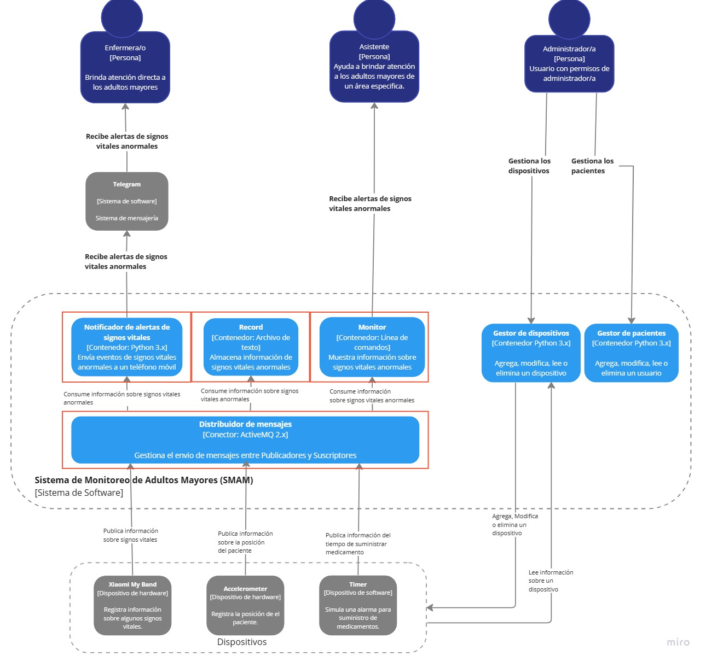
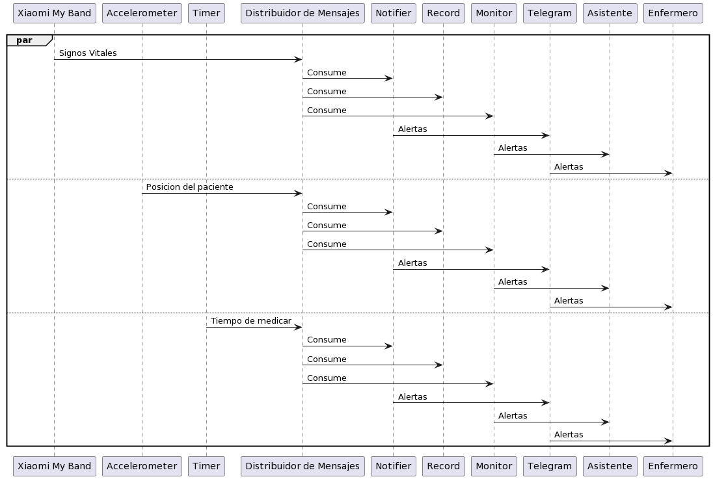

# Arquitectura Publica-Suscribe Equipo 4 

## Sistema de Monitoreo de Adultos Mayores (SMAM)

Existe un un lugar llamado Seten en el que viven un grupo de adultos mayores, parte del personal que trabaja en este lugar, entre otras tareas, se dedica a atender las necesidades de los adultos mayores y a monitorear su estado de salud.

La comunidad llamada Girls that Code in Python, que es una comunidad altruista en la región, decidió, a manera de donación, desarrollarles un sistema de cómputo para realizar las actividades de monitoreo del estado de salud de los adultos mayores de forma (semi-)automática. Para ello, la comunidad utilizó un conjunto de dispositivos “wearables” que portan cada uno de los adultos mayores. Mediante el envío de información sobre ritmo cardiaco, presión arterial y temperatura, estos dispositivos “wearables” permiten monitorear en tiempo real a cada uno de los adultos mayores y de esta forma ser más eficientes en la prevención de incidencias.

En la siguiente figura se muestra el diseño de la propuesta de solución del departamento de desarrollo para el SMAM.



En la siguiente figura se aprecia el comportamiento esperado basado en la imagen anterior:



## Estructura del proyecto

Este repositorio contiene los siguientes directorios y archivos:

```bash
    ├── docs                                # carpeta de documentación
    │  ├── Publica-Suscribe.jpg             # vista del contexto del sistema
    │  ├── DinamicaPUBSUB.png               # archivo editable de daiagramas del sistema 
    ├── publicadores                        # publicadores del sistema
    |  ├── src                              # código fuente de los publicadores
    │     ├── devices                       # archivos de definición de dispositivos
    │        ├── accelerometer.py           # simulador del dispositivo de hardware acelerómetro
    │        ├── timer.py                   # simulador del dispositivo de hardware cronómetro
    │        ├── xiaomi_my_band.py          # simulador de dispositivo de hardware Xiaomi
    │     ├── helpers                       # archivos auxiliares del sistema
    │        ├── __init__.py                # indica la definición de módulo python
    │        ├── publicador.py              # archivo auxiliar de comunicación con el distribuidor de mensajes 
    │     ├── __init__.py                   # indica la definición de módulo python
    │     ├── patient.py                    # representación de un adulto mayor en el sistema
    |  ├── main.py                          # archivo principal de ejecución de publicadores
    ├── suscriptores                        # suscriptores del sistema
    │  ├── monitor.py                       # suscriptor que muestra en pantalla las alertas del sistema
    │  ├── notifier.py                      # suscriptor que notifica a un(a) enfermero(a) en particular
    │  ├── record.py                        # suscriptor que actualiza el expediente de un adulto mayor en particular
    ├── .gitignore                          # exclusiones de git
    ├── README.md                           # este archivo
    ├── requirements.txt                    # dependencias del sistema
```


## Prerrequisitos
- Clonar el repositorio:
   ```shell
   $ git clone https://github.com/AdalbertoCV/Publica-Suscribe-Equipo4.git
   $ cd Publica-Suscribe-Equipo4
   ```

- Contar con pip y python 3.8 o superior, Ademas de contar con Anaconda para la creación de un entorno Virtual


- Se crea un entorno virtual con el siguiente comando

```
conda create --name pubsub python=3.8 -y
```


- Para activar el entorno:

```
source activate pubsub
```


- Descargar las dependencias correspondientes dentro de el entorno virtual:

```
pip3 install stomp.py
pip3 install Faker
pip3 install telepot
```

## Deploy activeMQ

```
docker run -p 8161:8161 -p 61613:61613 rmohr/activemq
```


# Ejecucion de el publicador de mensajes

````

cd publishers

python3 main.py

````

# Ejecucion de los suscriptores 

```
cd suscribers
```

- Notificador 

```
python3 notifier.py
```

- Log

```
python3 record.py
```

- Monitor

```
python3 monitor.py
```

## Versión

2.2.1 - Mayo 2023

## Autores

* **Narda Viktoria Gómez Aguilera**
* **Brayan Domínguez Saucedo**
* **Héctor Abraham Gónzalez Durán**
* **Elliot Axel Noriega**
* **Adalberto Cerrillo Vázquez**
