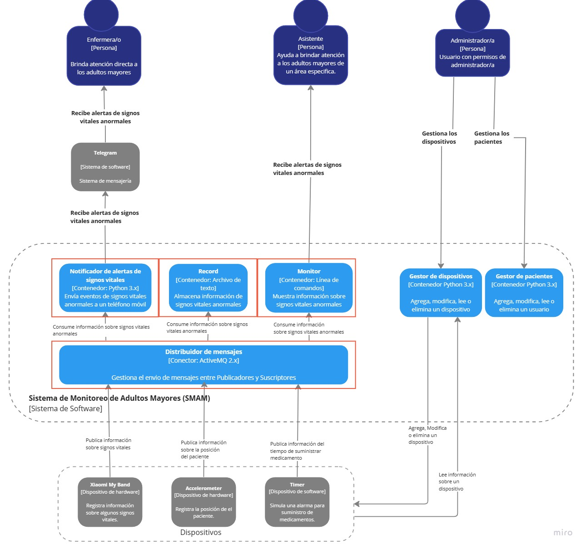
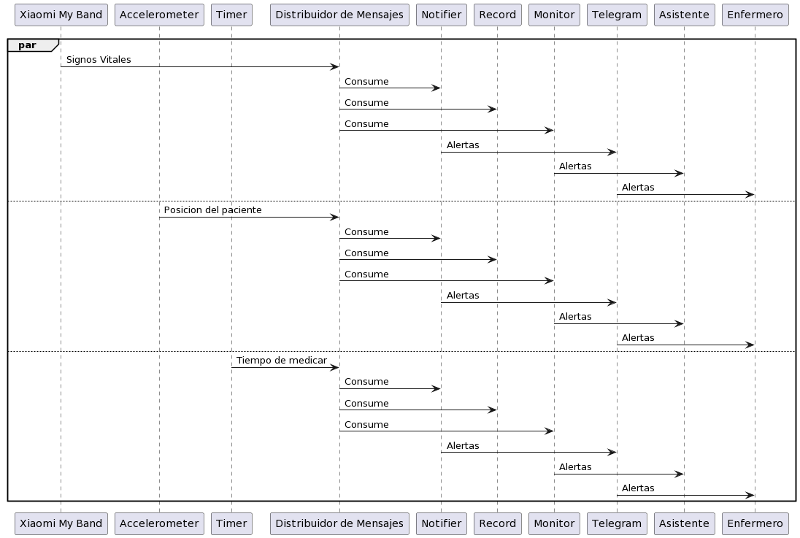

# SMAM — Sistema de Monitoreo de Adultos Mayores

Implementación del patrón arquitectónico **Publica-Suscribe** aplicado a un sistema de telemetría de salud en tiempo real. Dispositivos *wearables* simulados publican signos vitales; un conjunto de suscriptores independientes los consume en paralelo para mostrar alertas, notificar al personal de enfermería y actualizar expedientes.

Proyecto del curso de **Arquitectura de Software** de la Licenciatura en Ingeniería de Software (Universidad Autónoma de Zacatecas, mayo 2023).

---

## El problema

En la residencia Seten vive un grupo de adultos mayores. Parte del personal se dedica a monitorear su estado de salud de forma manual, lo que limita la capacidad de reacción ante incidencias.

La comunidad altruista *Girls that Code in Python* diseñó un sistema que automatiza ese monitoreo: cada residente porta dispositivos *wearables* que emiten continuamente **ritmo cardiaco, presión arterial y temperatura**.

### Por qué Publica-Suscribe

El reto arquitectónico no es leer los sensores, sino **repartir cada lectura a varios consumidores con necesidades distintas** —una pantalla de monitoreo, un notificador de enfermería, un expediente clínico— sin que los productores conozcan a los consumidores.

Publica-Suscribe resuelve exactamente eso: los publicadores emiten a un *topic* del distribuidor de mensajes y los suscriptores se registran a él de forma independiente. Agregar un consumidor nuevo no requiere tocar una sola línea del lado de los dispositivos, y la caída de un suscriptor no interrumpe a los demás.

### Vista de contenedores



### Dinámica del sistema



---

## Componentes

### Publicadores

Simulan el hardware que portan los residentes. Cada dispositivo genera lecturas y las publica en el *broker*:

| Módulo | Rol |
|---|---|
| `devices/xiaomi_my_band.py` | Pulsera de actividad: ritmo cardiaco y signos vitales |
| `devices/accelerometer.py` | Acelerómetro: detección de movimiento y posibles caídas |
| `devices/timer.py` | Cronómetro: marca temporal de las lecturas |
| `patient.py` | Representación del adulto mayor, con datos generados mediante **Faker** |
| `helpers/publicador.py` | Capa de comunicación con el broker vía **STOMP**, con mensajes persistentes |

### Suscriptores

Tres consumidores independientes, suscritos al mismo *topic* con `ack="auto"`:

| Suscriptor | Qué hace |
|---|---|
| `monitor.py` | Muestra en pantalla, en tiempo real, las alertas del sistema |
| `notifier.py` | Envía la alerta a un(a) enfermero(a) mediante un **bot de Telegram** (`telepot`) |
| `record.py` | Actualiza el expediente clínico persistente del residente |

---

## Estructura del repositorio

```
.
├── docs/                              # Documentación arquitectónica
│   ├── Publica-Suscribe.jpg           #   vista de contenedores
│   └── DinamicaPUBSUB.png             #   diagrama de secuencias
├── publicadores/                      # Lado productor
│   ├── src/
│   │   ├── devices/                   #   simuladores de hardware
│   │   │   ├── xiaomi_my_band.py
│   │   │   ├── accelerometer.py
│   │   │   └── timer.py
│   │   ├── helpers/publicador.py      #   comunicación STOMP con el broker
│   │   └── patient.py                 #   modelo del adulto mayor
│   └── main.py                        #   punto de entrada de los publicadores
├── suscriptores/                      # Lado consumidor
│   ├── monitor.py                     #   alertas en pantalla
│   ├── notifier.py                    #   notificación por Telegram
│   └── record.py                      #   actualización de expedientes
├── requirements.txt
└── README.md
```

---

## Cómo ejecutarlo

### 1. Preparar el entorno

```bash
git clone https://github.com/AdalbertoCV/Publica-Suscribe-Equipo4.git
cd Publica-Suscribe-Equipo4
```

Requiere **Python 3.8 o superior**. Con Conda:

```bash
conda create --name pubsub python=3.8 -y
conda activate pubsub
pip install -r requirements.txt
```

O con `venv`:

```bash
python -m venv .venv && source .venv/bin/activate   # Windows: .venv\Scripts\activate
pip install stomp.py Faker telepot
```

### 2. Levantar el broker de mensajes

```bash
docker run -p 8161:8161 -p 61613:61613 rmohr/activemq
```

- Puerto `61613` — protocolo **STOMP**, por donde se comunican publicadores y suscriptores.
- Puerto `8161` — consola de administración.

Para observar el flujo de mensajes, entra a `http://localhost:8161`, abre **Manage ActiveMQ broker** (usuario y contraseña `admin`) y revisa la sección **Queues**.

### 3. Arrancar los suscriptores

Cada uno en su propia terminal, **antes** de los publicadores:

```bash
cd suscriptores
python monitor.py     # alertas en pantalla
python record.py      # expedientes
python notifier.py    # notificación por Telegram
```

> `notifier.py` requiere configurar `self.token` y `self.chat_id` con las credenciales de tu propio bot de Telegram (se obtienen con [@BotFather](https://t.me/botfather)). Si se dejan vacíos, el suscriptor funciona pero omite el envío.

### 4. Arrancar los publicadores

```bash
cd publicadores
python main.py
```

A partir de aquí, cada lectura generada por los dispositivos aparece simultáneamente en los tres suscriptores.

---

## Stack

`Python 3.8` · `Apache ActiveMQ` · `STOMP (stomp.py)` · `Faker` · `telepot (Telegram Bot API)` · `Docker`

---

## Versión

**2.2.1** — Mayo 2023

---

## Autores

Proyecto desarrollado en equipo:

- **Narda Viktoria Gómez Aguilera**
- **Brayan Domínguez Saucedo**
- **Héctor Abraham González Durán**
- **Elliot Axel Noriega**
- **Adalberto Cerrillo Vázquez**

Universidad Autónoma de Zacatecas — Licenciatura en Ingeniería de Software.
